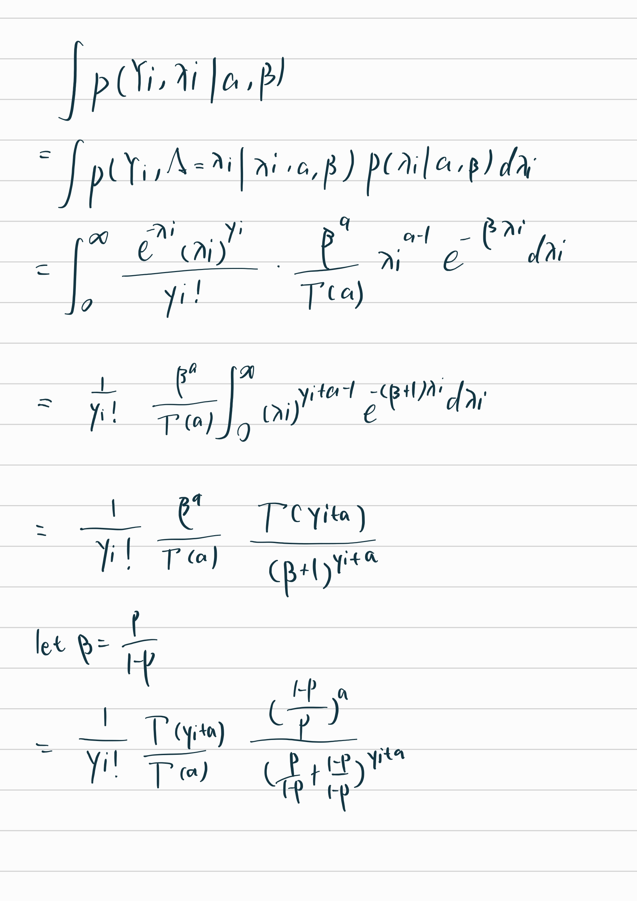
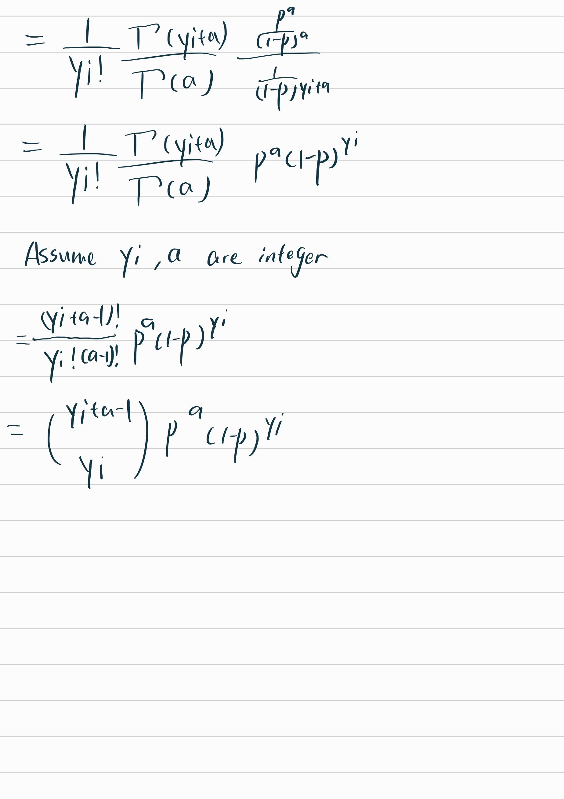

```{r setup, include=FALSE}
library(knitr)
library(testthat)
library(tidyverse)
library(patchwork)
eval <- TRUE
knitr::opts_chunk$set(echo=TRUE, 
                      cache=FALSE, 
                      fig.width=5, 
                      fig.height=5,
                      fig.align='center', 
                      eval=eval)
indent1 = '    '
indent2 = paste(rep(indent1, 2), collapse='')
indent3 = paste(rep(indent1, 3), collapse='')
r = function(x, digits=2){ round(x, digits=digits) }

```

# Text Analysis of JK Rowling's Harry Potter Series

# Question 1

You are interested in studying the writing style and tone used by JK Rowling (JKR for short), the author of the popular Harry Potter series. You select a random sample of chapters of size $n$ from all of JKR's books. You are interested in the rate at which JKR uses the word *stone* in her writing, so you count how many times the word *stone* appears in each chapter in your sample, $(y_1,...,y_n)$. In this set-up, $y_i$ is the number of times the word *stone* appeared in the $i$-th randomly sampled chapter. In this context, the population of interest is all chapters written by JRK and the population quantity of interest (the estimand) is the rate at which JKR uses the word *stone*. The sampling units are individual chapters. Note: this assignment is partially based on text analysis package known as [tidytext](https://www.tidytextmining.com/tidytext.html%5D). You can read more about tidytext [here](https://uc-r.github.io/tidy_text).

## 1a. (5 pts)

Model: let $Y_i$ denote the quantity that captures the number of times the word *stone* appears in the $i$-th chapter. As a first approximation, it is reasonable to model the number of times *stone* appears in a given chapter using a Poisson distribution. *Reminder:* Poisson distributions are for integer outcomes and useful for events that occur independently and at a constant rate. Let's assume that the quantities $Y_1,...Y_n$ are independent and identically distributed (IID) according to a Poisson distribution with unknown parameter $\lambda$, $$p(Y_i=y_i\mid\lambda) = \hbox{Poisson} (y_i \mid\lambda) \quad \hbox{ for } \quad     i=1,...,n.$$

Write the likelihood $L(\lambda)$ for a generic sample of $n$ chapters, $(y_1,...,y_n)$. Simplify as much as possible (i.e. get rid of any multiplicative constants)

\begin{eqnarray}
L(\lambda) = \prod_{i=1}^{n} f(y_{i};\lambda) &=& \prod_{i=1}^{n} \frac{e^{-\lambda} \lambda^{y_{i}}}{y_{i}!} \\
&=& \frac{e^{-\sum^n_{i=1} \lambda} \lambda^{\sum^n_{i=1} y_{i}} }{\prod^n_{i=1} y_{i}!} \\
\end{eqnarray}

## 1b. (5 pts)

Write the log-likelihood $\ell(\lambda)$ for a generic sample of $n$ articles, $(y_1,...,y_n)$. Simplify as much as possible. Use this to compute the maximum likelihood estimate for the rate parameter of the Poisson distribution.

From now on, we'll focus on JKR's writing style in the first Harry Potter book, *Philosopher's Stone*. This book has 17 chapters. Below is the code for counting the number of times *stone* appears in each chapter of *Philosopher's Stone* . We use the `tidytext` R package which includes functions that parse large text files into word counts. The code below creates a vector of length 17 which has the number of times the word *stone* was used in that chapter (see <https://uc-r.github.io/tidy_text> for more on parsing text with `tidytext`)

```{r}
# install.packages("devtools")
# devtools::install_github("bradleyboehmke/harrypotter")
```

```{r parse_text}
library(tidyverse)      # data manipulation & plotting
library(stringr)        # text cleaning and regular expressions
library(tidytext)       # provides additional text mining functions
library(harrypotter)    # text for the seven novels of the Harry Potter series

text_tb <- tibble(chapter = seq_along(philosophers_stone),
                  text = philosophers_stone)


tokens <- text_tb %>% unnest_tokens(word, text)
word_counts <- tokens %>% group_by(chapter) %>% 
  count(word, sort = TRUE) %>% ungroup
word_counts_mat <- word_counts %>% spread(key=word, value=n, fill=0)

stone_counts <- word_counts_mat$stone
stone_counts
```

\begin{eqnarray}
\ell(\lambda) = \ln(L(\lambda)) &=& -n\lambda + ln(\lambda)\sum_{i=1}^{n} y_{i} - ln(\prod_{i=1}^{n} y_{i}!) \\
&=& -n\lambda + ln(\lambda)\sum_{i=1}^{n} y_{i} - \sum_{i=1}^{n} ln(y_{i}!)
\end{eqnarray}

$$
\frac{\partial}{\partial\lambda} =-n + \frac{\sum y_{i}}{\lambda} = 0
$$

$$
\lambda = \frac{\sum y_{i}}{n}
$$

$$
\frac{\partial^2}{\partial^2\lambda} =-\frac{\sum y_{i}}{\lambda^2} = - \frac{\sum y_i}{(\frac{\sum y_i}{n})^2} = - \frac{n^2}{\sum y_i} < 0
$$

## 1c. (5 pts)

Make a bar plot where the heights are the counts of the word *stone* and the x-axis is the chapter.

```{r}
head(stone_counts)
names(stone_counts) <- c(1:17)
barplot(stone_counts)
```

## 1d. (10 pts)

Plot the log-likelihood of the Poisson rate of *stone* usage in R using the data in `stone_counts`. Then use `stone_counts` to compute the maximum likelihood estimate of the rate of the usage of the word *stone* in Philosopher's Stone. Mark this maximum on the log-likelihood plot with a vertical line (use `abline` if you make the plot in base R or `geom_vline` if you prefer `ggplot`).

```{r}
lambda = seq(0,10,0.1)
ln_lambda = log(lambda, exp(1))
total_stone = sum(stone_counts)
ln_product = sum(log(factorial(stone_counts), exp(1)))
n = length(stone_counts)

likelihood = -n*lambda+ln_lambda*total_stone-ln_product

log.likelihood <- data.frame(x=lambda, y = likelihood)

mle = total_stone/n

log.likelihood %>% ggplot(aes(x=x, y = y)) +
    geom_line() +
    geom_vline(xintercept = mle, color = "red")
```

# Question 2

For the previous problem, when computing the rate of *stone* usage, we were implicitly assuming each chapter had the same length. Remember that for $Y_i \sim \text{Poisson}(\lambda)$, $E[Y_i] = \lambda$ for each chapter, that is, the average number of occurrences of *stone* is the same in each chapter. Obviously this isn't a great assumption, since the lengths of the chapters vary; longer chapters should be more likely to have more occurrences of the word. We can augment the model by considering properties of the Poisson distribution. The Poisson is often used to express the probability of a given number of events occurring for a fixed \`\`exposure''. As a useful example of the role of the exposure term, when counting then number of events that happen in a set length of time, we to need to account for the total time that we are observing events. For this text example, the exposure is not time, but rather corresponds to the total length of the chapter.

We will again let $(y_1,...,y_n)$ represent counts of the word *stone*. In addition, we now count the total number of words in each each chapter $(\nu_1,...,\nu_n)$ and use this as our exposure. Let $Y_i$ denote the random variable for the counts of the word *stone* in a chapter with $\nu_i$ words. Let's assume that the quantities $Y_1,...Y_n$ are independent and identically distributed (IID) according to a Poisson distribution with unknown parameter $\lambda \cdot \frac{\nu_i}{1000}$, $$
p(Y_i=y_i\mid \nu_i, 1000) = \hbox{Poisson} (y_i \mid\lambda \cdot \frac{\nu_i}{1000}) \quad \hbox{ for } \quad i=1,...,n.
$$

In the code below, `chapter_lengths` is a vector storing the length of each chapter in words.

```{r chapter_lengths, dependson="parse_text", out.width="50%"}
chapter_lengths <- word_counts %>% group_by(chapter) %>% 
summarize(chapter_length = sum(n)) %>% 
ungroup %>% select(chapter_length) %>% unlist %>% as.numeric
chapter_lengths
```

## 2a. (5 pts)

What is the interpretation of the quantity $\frac{\nu_i}{1000}$ in this model? What is the interpretation of $\lambda$ in this model? State the units for these quantities in both of your answers.

$\frac{\nu_i}{1000}$ is the number of (1k) words, 1000 normalize the quantity to be 1000-words basis, and it can measure the relative size for the word stone to appear

$\lambda$ is the average rate for the stone to appear for every 1k words in a chapter

## 2b. (5 pts)

List the known and unknown variables and constants, as described in lectures 1 and 2. Make sure your include $Y_1, ..., Y_n$, $y_1, ..., y_n$, $n$, $\lambda$, and $\nu_i$.

| \\                 | Unknown                 | Known                              |
|------------------|----------------------|--------------------------------|
| Var \> 0 (random)  | $Y_{1}, \ldots, Y_{n}$, | NA                                 |
| Var = 0 (constant) | $\lambda$               | $y_{1}, \ldots, y_{n}$, $n, \nu_i$ |

## 2c. (5 pts)

Write down the likelihood in this new model. Use this to calculate maximum likelihood estimator for $\lambda$. Your answer should include the $\nu_i$'s.

\begin{eqnarray}
L(\lambda) = \prod_{i=1}^{n} f(y_{i};\lambda) &=& \prod_{i=1}^{n} \frac{e^{-\frac{\lambda\nu_i}{1000}} (\frac{\lambda \nu_i}{1000})^{y_{i}}}{y_{i}!} \\
&=& \frac{e^{-\frac{\lambda\sum \nu_i}{1000}} \prod{\frac{\lambda\nu_i}{1000}}^{y_{i}} }{\prod y_{i}!} \\
\end{eqnarray}

\begin{eqnarray}
\ell(\lambda) = \ln(L(\lambda)) &=& -\frac{\lambda\sum \nu_i}{1000} + \sum_{i=1}^{n} ln(\frac{\lambda\nu_i}{1000})y_{i} - ln(\prod_{i=1}^{n} y_{i}!) \\
&=& -\frac{\lambda\sum \nu_i}{1000} + \sum_{i=1}^{n} y_{i}\cdot (\ln(\lambda) + ln(\frac{\nu_i}{1000})) - ln(\prod_{i=1}^{n} y_{i}!) \\
&=& -\frac{\lambda\sum \nu_i}{1000} + \sum_{i=1}^{n} y_{i}\cdot \ln(\lambda)  + \sum_{i=1}^{n} y_{i} \cdot ln(\frac{\nu_i}{1000}) - ln(\prod_{i=1}^{n} y_{i}!) \\
\end{eqnarray}

$$
\frac{\partial}{\partial\lambda} =-\frac{\sum \nu_i}{1000} + \frac{\sum y_{i}}{\lambda} = 0
$$

$$
\lambda = \frac{1000\cdot\sum y_{i}}{\sum \nu_i}
$$

$$
\frac{\partial^2}{\partial^2\lambda} =-\frac{\sum y_{i}}{\lambda^2} = - \frac{\sum y_i}{(\frac{1000\sum y_i}{\sum \nu_i})^2} = - \frac{(\sum \nu_i)^2}{1000^2\sum y_i} < 0
$$

## 2d. (5 pts)

Compute the maximum likelihood estimate and save it in the variable `lambda_mle`. In 1-2 sentences interpret its meaning (make sure you include units in your answers!).

```{r}
chapter_lengths_per_1k =  chapter_lengths/1000
sum_of_words_per_1k = sum(chapter_lengths_per_1k)
total_stone
lambda_mle = total_stone/sum_of_words_per_1k
```

The number of the occurrence of stone per 1k words in each chapter

## 2e. (10 pts)

Plot the log-likelihood from the previous question in R using the data from on the frequency of *stone* and the chapter lengths. Add a vertical line at the value of `lambda_mle` to indicate the maximum likelihood.

```{r}
lambda = seq(0,5,0.01)
total_stone = sum(stone_counts)
likelihood2 = -lambda*sum_of_words_per_1k+total_stone*log(lambda, exp(1))+sum(stone_counts*log(chapter_lengths/1000), exp(1)) - ln_product

log.likelihood2 <- data.frame(x=lambda, y = likelihood2)


log.likelihood2 %>% ggplot(aes(x=x, y = y)) +
    geom_line() +
    geom_vline(xintercept = lambda_mle, linetype = "solid", color = "red")

log.likelihood2$x[which.max(log.likelihood2$y)]
```

# Question 3

Correcting for chapter lengths is clearly an improvement, but we're still assuming that JKR uses the word *stone* at the same rate in all chapters. In this problem we'll explore this assumption in more detail.

## 3a. (5 pts)

Why might it be unreasonable to assume that the rate of *stone* usage is the same in all chapters? Comment in a few sentences.

The distribution of the word stone in each chapter depends on the plot of the chapter. In some chapters with plot heavily connected to stone, the word is more frequently used. And in others, not so much

## 3b. (2 + 4 pts)

We can use simulation to check our Poisson model, and in particular the assumption that the rate of *stone* usage is the same in all chapters. Generate simulated counts of the word *stone* by sampling counts from a Poisson distribution with the rate $(\hat \lambda_{\text{MLE}} \nu_i) /1000$ for each chapter $i$. $\hat \lambda_{\text{MLE}}$ is the maximum likelihood estimate computing in 2d. Store the vector of these values for each chapter in a variable of length 17 called `lambda_chapter`. Make a side by side plot of the observed counts and simulated counts and note any similarities or differences (we've already created the observed histogram for you). Are there any outliers in the observed data that don't seem to be reflected in the data simulated under our model?

```{r}
observed_histogram <- ggplot(word_counts_mat) + geom_histogram(aes(x=stone), binwidth = 1) + 
   xlim(c(0, 26)) + ylim(c(0,10)) + ggtitle("Observed")

lambda_chapter <- lambda_mle*chapter_lengths_per_1k

simulated_counts <- tibble(stone = rpois(17, lambda_chapter))
# simulated_counts
simulated_histogram <- ggplot(simulated_counts) + geom_histogram(aes(x=stone)) + xlim(c(0, 26)) + ylim(c(0,10)) + ggtitle("Simulated")

## This uses the patchwork library to put the two plots side by side
observed_histogram + simulated_histogram

```

There're some outliers. Some chapter has two chapter with stone usage over 13 and the max count is 25

## 3c. (5 + 5 pts)

Assume the word usage rate varies by chapter, that is, $$
p(Yi=y_i\mid \lambda, \nu_i, 1000) = \hbox{Poisson} (y_i \mid\lambda_i \cdot \frac{\nu_i}{1000}) \quad \hbox{ for } \quad i=1,...,n.
$$

Compute a separate maximum likelihood estimate of the rate of *stone* usage (per 1000 words) in each chapter, $\hat \lambda_i$. Make a bar plot of $\hat \lambda_i$ by chapter. Save the chapter-specific MLE in a vector of length 17 called `lambda_hats`. Which chapter has the highest rate of usage of the word *stone*? Save the chapter number in a variable called `stonest_chapter`.

\begin{eqnarray}
\ell(\lambda_i) = \ln(L(\lambda_i)) 
&=& -\frac{\sum \lambda_i \nu_i}{1000} + \sum_{i=1}^{n} y_{i}\ln(\lambda_i)  + \sum_{i=1}^{n} y_{i} \cdot ln(\frac{\nu_i}{1000}) - ln(\prod_{i=1}^{n} y_{i}!) \\
\end{eqnarray}

$$
\frac{\partial}{\partial\lambda_i} =-\frac{\nu_i}{1000} + \frac{y_{i}}{\lambda_i} = 0
$$

$$
\lambda_i = \frac{1000y_i}{v_i}
$$

```{r, dependson="chapter_lengths"}

# Maximum likelihood estimate
lambda_hats <- 1000*stone_counts/chapter_lengths

stonest_chapter <-  which.max(lambda_hats)


# Make a bar plot of the MLEs, lambda_hats
ggplot(data.frame(x=lambda_hats), aes(x)) +
    geom_bar()
```

# Question 4

Let's go back to our original model for usage rates of the word *stone*. You collect a random sample of book chapters penned by JKR and count how many times she uses the word *stone* in each of the chapter in your sample, $(y_1,...,y_n)$. In this set-up, $y_i$ is the number of times the word *stone* appeared in the $i$-th chapter, as before. However, we will no longer assume that the rate of use of the word *stone* is the same in every chapter. Rather, we'll assume JKR uses the word *stone* at different rates $\lambda_i$ in each chapter. Naturally, this makes sense, since different chapters have different themes. To do this, we'll further assume that the rate of word usage $\lambda_i$ itself, is distributed according to a Gamma($\alpha$, $\beta$) with known parameters $\alpha$ and $\beta$, $$
   f(\Lambda=\lambda_i\mid \alpha,\beta) = \hbox{Gamma} (\lambda_i \mid\alpha,\beta).
  $$ and that $Y_i \sim \text{Pois}(\lambda_i)$ as in problem 1. For now we will ignore any exposure parameters, $\nu_i$. Note: this is a "warm up" to Bayesian inference, where it is standard to treat parameters as random variables and specify distributions for those parameters.

## 4a. (5 pts)

Write out the the data generating process for the above model.

```{r}
stone_gen <- function(n, a, b) {
    results = c()
    lambda_i = rgamma(n, a, b)
    for (i in 1:n) {
        y_i = rpois(1, lambda_i[i])
        results = c(results, y_i)
    }
    return(results)
}
```

## 4b. (2 + 4 + 4 pts)

In R simulate 1000 values from the above data generating process, assume $\alpha=10$ (shape parameter of `rgamma`) and $\beta=1$ (rate parameter of `rgamma`). Store the value in a vector of length 1000 called `counts`. Compute the empirical mean and variance of values you generated. For a Poisson distribution, the mean and the variance are the same. In the following distribution is the variance greater than the mean (called `overdispsersed`) or is the variance less than the mean (`underdispersed`)? Intuitively, why does this make sense?

```{r}
## Store simulated data in a vector of length 1000
counts <- stone_gen(1000, 10, 1)

print(mean(counts))
print(var(counts))
```

The mean is less than variance (over dispersed) - because the lambda_i is from a gamma distribution, the poission value will have more variability. - and since the mixture is also a negative binomial where the variance is always greater than mean

## 4c. (5 pts)

List the known and unknown variables and constants as described in lecture 2. Make sure your table includes $Y_1, ..., Y_n$, $y_1, ..., y_n$, $n$, $\lambda$, $\alpha$, and $\beta$.

| \\                 | Unknown                                                | Known                                      |
|----------------|--------------------------------|------------------------|
| Var \> 0 (random)  | $Y_{1}, \ldots, Y_{n}$, $\lambda_1, \ldots, \lambda_i$ | NA                                         |
| Var = 0 (constant) | NA (unless a,b is not specified)                       | $y_{1}, \ldots, y_{n}$, $n, \alpha, \beta$ |

# Question 5 (4 pts)

Compute $p(Y_i \mid \alpha, \beta) = \int p(Y_i, \lambda_i \mid \alpha, \beta) d\lambda_i$. *Hint:* The gamma function is defined as $\Gamma ( z ) = \int _ { 0 } ^ { \infty } x ^ { z - 1 } e ^ { - x } d x$. *NEW HINT:* From the Gamma distribution, we can see that $\frac{\Gamma(\alpha)}{\beta^{\alpha}} = \int_0^{\infty} x^{\alpha-1}e^{-\beta x}dx$.





You just showed that a Gamma mixture of Poisson distributions is a negative binomial
