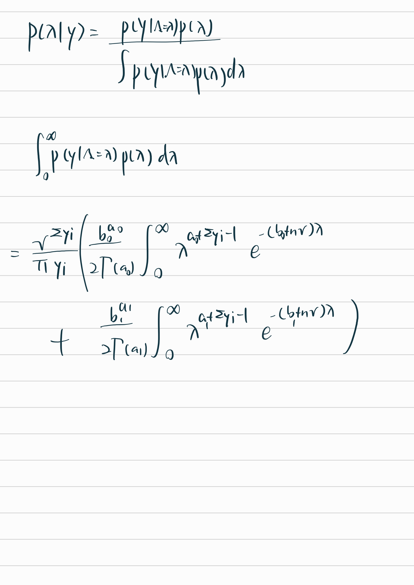
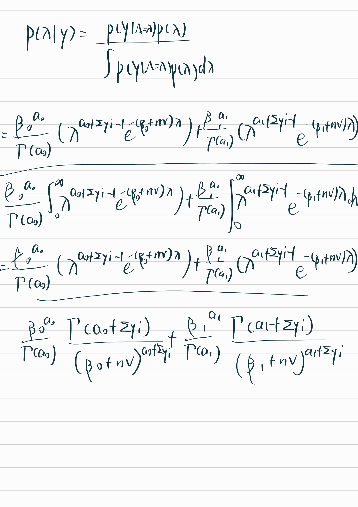

```{r setup, include=FALSE}
library(knitr)
library(testthat)
knitr::opts_chunk$set(echo=TRUE, 
                      cache=FALSE,
                      eval = TRUE,
                      fig.width=5, 
                      fig.height=5,
                      fig.align='center')
indent1 = '    '
indent2 = paste(rep(indent1, 2), collapse='')
indent3 = paste(rep(indent1, 3), collapse='')
r = function(x, digits=2){ round(x, digits=digits) }
library(tidyverse)
library(reshape2)
```

## 1. Knowing someone who is transgender

A September 2016 Pew Research survey found that 30% of U.S. adults are aware that they know someone who is transgender. It is now the 2020s, and Sylvia believes that the current percent of people who know someone who is transgender, $\pi$, has increased to somewhere between 35% and 60%.

**1a.** (4pts) Identify and plot a Beta model that reflects Sylvia's prior ideas about $\pi$.

```{r}
# sample a beta model with parameter 3 and 7
# plot the beta model

model = rbeta(10000, 3, 7)

ggplot(data.frame(x = model), aes(x)) +
  geom_density() +
  labs(x = expression(pi), y = "Density") +
  theme_bw()
```

**1b.** (4pts) Sylvia wants to update her prior, so she randomly selects 200 US adults and 80 of them are aware that they know someone who is transgender. Specify and plot the posterior model for $\pi$?

```{r}
# update the beta model
updated_model = rbeta(10000, 3 + 80, 7 + 200 - 80)

ggplot(data.frame(x = updated_model), aes(x)) +
  geom_density() +
  labs(x = expression(pi), y = "Density") +
  theme_bw()

```

**1c.** (5pts) What is the mean, mode, and standard deviation of the posterior model?

```{r}
mean(updated_model) # mean
pmf = density(updated_model)
pmf$x[which.max(pmf$y)] # mode
sd(updated_model) # sd
```

calculated mean: 3+80/(3+7+200) = 83/210 = 0.3952 calculated mode: 3+80-1/(3+7+200-2) = 82/209 = 0.3923 calculated sd: sqrt((3+80)(7+200-80)/((3+7+200)\^2(3+7+200-1))) = 0.0335

**1d.** (7pts) Describe how the prior and posterior Beta models compare. Hint: in class we showed a special way in which we can write the posterior mean in a Beta-Binomial model. How can this help? Check the lectures notes.

The prior and posterior Beta models are similar in shape, but the posterior model is more concentrated around the mean. This is because the posterior model is updated with the new information from the data. The posterior mean is the weighted average of the prior mean and the sample mean, where the weights are the prior and sample sizes, respectively. Since the sample size is much larger than the prior size, the posterior mean is closer to the sample mean than the prior mean. This is why the posterior model is more concentrated around the sample mean.

## 2. Sample survey

Suppose we are going to sample 100 individuals from a county (of size much larger than 100) and ask each sampled person whether they support policy $Z$ or not. Let $Y_i=1$ if person $i$ in the sample supports the policy, and $Y_i=0$ otherwise.

**2a.** (5pts) Assume $Y_1,\ldots,Y_{100}$ are, conditional on $\theta$, iid binary random variables with expectation $\theta$. Write down the joint distribution of $P(Y_1 = y_1, \dots, Y_{100}=y_{100}) \mid \theta)$ in a compact form. Also write down the form of $P(\sum_{i=1}^{100} Y_i = y \mid \theta )$.

```{=tex}
\begin{eqnarray}
P(Y_1 = y_1, \ldots, Y_{100} = y_{100} | \theta) 
&=& P(Y_1 = y_1 | \theta)\cdots P(Y_{100} = y_{100}|\theta) \\
&=& \prod^{100}_{i=1} P(Y_i = y_i |\theta) \\
&=& \prod^{100}_{i=1} \theta^{y_i}(1-\theta)^{y_i} \\
&=& \theta^{\sum y_i}(1-\theta)^{\sum y_i} \\
\end{eqnarray}
```
```{=tex}
\begin{eqnarray}
P(\sum_{i=1}^{100} Y_i = y| \theta) 
&=& {100 \choose y} \theta^{y} (1-\theta)^{100-y}
\end{eqnarray}
```
**2b.** (5pts) For the moment, suppose you believed that $\theta \in \{0.0, 0.1, \ldots, 0.9, 1.0\}$. Given that the results of the survey were $\sum_{i=1}^{100} y_i = 57$, compute $P(\sum_{i=1}^{100} Y_i = 57 \mid \theta)$ for each of the 11 values of $\theta$ and plot these probabilities.

```{r}
theta = seq(0, 1, 0.1)
prob = dbinom(57, 100, theta)

ggplot(data.frame(x = theta, y = prob), aes(x, y)) +
  geom_point() +
  labs(x = expression(theta), y = "Probability") +
  geom_line() +
  theme_bw()

```

**2c.** (5pts) Now suppose you originally had no prior information to believe one of these $\theta$-values over another, and so $P(\theta = 0.0) = P(\theta=0.1) = \ldots = P(\theta = 1.0)$. Use Baye's rule to compute $p(\theta \mid \sum_{i=1}^{100} Y_i=57)$ for each $\theta$ value. Make a plot of this posterior distribution as a function of $\theta$.

```{r}
# compute the posterior distribution
likelihood = prob
prior = 1/11
normalizing_constant = sum(likelihood * prior)
posterior = likelihood * prior / normalizing_constant

ggplot(data.frame(x = theta, y = posterior), aes(x, y)) +
  geom_point() +
  labs(x = expression(theta), y = "Probability") +
  geom_line() +
  theme_bw()

```

**2d.** (5pts) Now suppose you allow $\theta$ to be any value in the interval $[0,1]$. Using the uniform prior density for $\theta$, so that $p(\theta) = 1$, plot the *kernel* of the posterior density $p(\theta) \times P(\sum_{i=1}^{100} Y_i = 57 \mid \theta)$ as a function of $\theta$.

```{r}
# compute the posterior distribution
n = 100
theta = runif(n, 0, 1)
likelihood = dbinom(57, 100, theta)
prior = 1

kernel = likelihood * prior

ggplot(data.frame(x = theta, y = kernel), aes(x, y)) +
  geom_point() +
  labs(x = expression(theta), y = "Probability") +
  geom_line() +
  theme_bw()
```

## 3. Soccer World cup

Let $\lambda$ be the average number of goals scored in a Women's World Cup game. We'll analyze $\lambda$ by the following a $Y_i$ is the observed number of goals scored in a sample of World Cup games: $$\begin{split} Y_i | \lambda & \stackrel{ind}{\sim} \text{Pois}(\lambda) \\ \lambda & \sim \text{Gamma}(1, 0.25) \\ \end{split}$$

**3a.** (5pts) Plot and summarize our prior understanding of $\lambda$.

```{r}
lambda = rgamma(1000, 1, 0.25)

ggplot(data.frame(x = lambda), aes(x)) +
  geom_density() +
  labs(x = expression(lambda), y = "Frequency") +
  expand_limits(x = 0) +
  scale_x_continuous(expand = c(0, 0)) +
  theme_bw()

paste("mean:", 1/0.25)
paste("sd:", 1/sqrt(0.25))
paste("mode:", (1-1)/0.25)
```

**3b.** (5pts) Why is the Poisson model a reasonable choice for our data $Y_i$?

because the number of goal is a count variable and the poisson distribution is a discrete distribution that expresses the probability of a given number of events occurring in a fixed interval of time or space if these events occur with a known constant mean rate and independently of the time since the last event.

and the conjugate prior for the poisson distribution is the gamma distribution.

**3c.** (5pts) The `wwc_2019_matches` data in the *fivethirtyeight* package includes the number of goals scored by the two teams in each 2019 Women's World Cup match. Define, plot, and discuss the total number of goals scored per game:

```{r}
library(fivethirtyeight)
data("wwc_2019_matches")
wwc_2019_matches <- wwc_2019_matches %>% 
  mutate(total_goals = score1 + score2)

ggplot(data = wwc_2019_matches, aes(x = total_goals)) +
  geom_histogram(binwidth = 1) +
  labs(x = "total goals", y = "Frequency") +
  theme_bw()

paste("mean:", mean(wwc_2019_matches$total_goals))
paste("var:", var(wwc_2019_matches$total_goals))
paste("sd:", sd(wwc_2019_matches$total_goals))
```

The total number of goals plot is a right skewed distribution with a mean of 2.8 and a standard deviation of 1.9.

**3d.** (5pts) Identify the posterior model, ie, what is the posterior distribution (including its parameters).

The posterior distribution is a gamma distribution with parameters $\alpha = 1 + \sum_{i=1}^{n} Y_i$ and $\beta = 0.25 + n$.

```{r}
alpha = 1 + sum(wwc_2019_matches$total_goals)
beta = 0.25 + nrow(wwc_2019_matches)
paste("alpha:", alpha)
paste("beta:", beta)
```

**3e.** (5pts) Plot the prior, likelihood and posterior for $\lambda$. Describe the evolution in your understanding of $\lambda$ from the prior to the posterior.

```{r}
# compute the posterior distribution

lambda = rgamma(1000, 1, 0.25)
lambda_prior = dgamma(lambda, 1, 0.25)

likelihood_cal = function (lambda) {
  prod(dpois(wwc_2019_matches$total_goals, lambda))
}

likelihood = sapply(lambda, likelihood_cal)

normalizing_constant = sum(likelihood * lambda_prior)
posterior_lambda = likelihood * lambda_prior / normalizing_constant

# plot prior
ggplot(data.frame(x = lambda), aes(x)) +
  geom_density() +
  labs(x = expression(lambda), y = "Frequency") +
  expand_limits(x = 0) +
  scale_x_continuous(expand = c(0, 0)) +
  theme_bw()

# plot likelihood
ggplot(data.frame(y = likelihood, x = lambda), aes(x, y)) +
  geom_line() +
  labs(x = expression(lambda), y = "Likelihood") +
  expand_limits(x = 0) +
  scale_x_continuous(expand = c(0, 0)) +
  theme_bw()

# plot posterior
ggplot(data.frame(x = lambda, y = posterior_lambda), aes(x, y)) +
  labs(x = expression(lambda), y = "Probability") +
  geom_line() +
  expand_limits(x = 0) +
  scale_x_continuous(expand = c(0, 0)) +
  geom_vline(xintercept = lambda[which.max(posterior_lambda)], color = "red") +
  theme_bw()
```

My understanding of prior is that it is a gamma distribution with parameters $\alpha = 1$ and $\beta = 0.25$. By providing evidence for each new number of goals that follows a poisson distribution with rate that connects to the prior, a likelihood function for the parameter $\lambda$ is constructed. And the posterior distribution is calculated given the likelihood of each $\lambda$ and the probability in prior distribution for that rate to occur.

## 4. A Mixture Prior for Heart Transplant Surgeries

A hospital in the United States wants to evaluate their success rate of heart transplant surgeries. We observe the number of deaths, $y$, in a number of heart transplant surgeries. Let $y \sim \text{Pois}(\nu\lambda)$ where $\lambda$ is the rate of deaths/patient and $\nu$ is the exposure (total number of heart transplant patients). When measuring rare events with low rates, maximum likelihood estimation can be notoriously bad. We'll tak a Bayesian approach. To construct your prior distribution you talk to two experts. The first expert thinks that $p_1(\lambda)$ with a $\text{gamma}(3, 2000)$ density is a reasonable prior. The second expert thinks that $p_2(\lambda)$ with a $\text{gamma}(7, 1000)$ density is a reasonable prior distribution. You decide that each expert is equally credible so you combine their prior distributions into a mixture prior with equal weights: $p(\lambda) = 0.5 * p_1(\lambda) + 0.5 * p_2(\lambda)$

**4a.** (10pts) What does each expert think the mean rate is, *a priori*? Which expert is more confident about the value of $\lambda$ a priori (i.e. before seeing any data)?

```{r}
expert1 = rgamma(1000, 3, 2000)
expert2 = rgamma(1000, 7, 1000)

# plot both
ggplot(data.frame(e1 = expert1, e2 = expert2)) +
  geom_density(aes(x = e1), color = "red") +
  geom_density(aes(x = e2), color = "blue") +
  labs(x = expression(lambda), y = "Frequency") +
  theme_bw()

sd(expert1)
sd(expert2)
```

The first expert thinks that the mean rate is 0.0015 and the second expert thinks that the mean rate is 0.007. The first expert is more confident about the value of $\lambda$ a priori because the variance is smaller.

**4b.** (5pts) Plot the mixture prior distribution.

```{r}
# plot mixture
lambda = seq(0, 0.1, 0.0001)
p1 = 0.5*dgamma(lambda, 3, 2000)
p2 = 0.5*dgamma(lambda, 7, 1000)

p = p1 + p2

ggplot(data.frame(x = lambda, y = p), aes(x, y)) +
  geom_line() +
  labs(x = expression(lambda), y = "Probability") +
  expand_limits(x = 0) +
  scale_x_continuous(expand = c(0, 0)) +
  theme_bw()
```

**4c.** (10pts) Suppose the hospital has $y=8$ deaths with an exposure of $\nu=1767$ surgeries performed. Write the posterior distribution up to a proportionality constant by multiplying the likelihood and the prior density. Plot this unnormalized posterior distribution and add a vertical line at the MLE. *Warning:* be very careful about what constitutes a proportionality constant in this example.

```{r}
lambda_prior = p1+p2
likelihood_cal = function (lambda) {
  prod(dpois(8, lambda))
}
likelihood = sapply(lambda, likelihood_cal)
unnornmalized_posterior = likelihood * lambda_prior

mle = lambda[which.max(unnornmalized_posterior)]

ggplot(data.frame(x = lambda, y = unnornmalized_posterior), aes(x, y)) +
  labs(x = expression(lambda), y = "Probability") +
  geom_line() +
  expand_limits(x = 0) +
  scale_x_continuous(expand = c(0, 0)) +
  geom_vline(xintercept = mle, color = "red") +
  theme_bw()

```

```{=tex}
\begin{eqnarray}
f(\lambda|y_i) 
&\propto& \frac{1}{\prod y_i !}(\nu \lambda)^{\sum y_i} e^{-n\nu\lambda} (\frac{\beta_{1}^{\alpha_1}}{2\Gamma(\alpha_1)} \lambda^{\alpha_1-1}e^{\beta_1\lambda_1} + \frac{\beta_{2}^{\alpha_1}}{2\Gamma(\alpha_2)} \lambda^{\alpha_2-1}e^{\beta_2\lambda_1})\\
&\propto& \lambda^{\sum y_i + \alpha_1 - 1} e^{-(\beta_1+n\nu)\lambda} + \lambda^{\sum y_i + \alpha_2 - 1} e^{-(\beta_2+n\nu)\lambda} \\
&\propto& \lambda^{10} e^{-(3767)\lambda} + \lambda^{14} e^{-(2767)\lambda}
\end{eqnarray}
```
**4e.** (10pts) Let $K = \int L(\lambda; y)p(\lambda) d\lambda$ be the integral of the proportional posterior. Then the proper posterior density, i.e. a true density integrates to 1, can be expressed as $p(\lambda \mid y) = \frac{L(\lambda; y)p(\lambda)}{K}$. Compute this posterior density and clearly express the density as a mixture of two gamma distributions.




