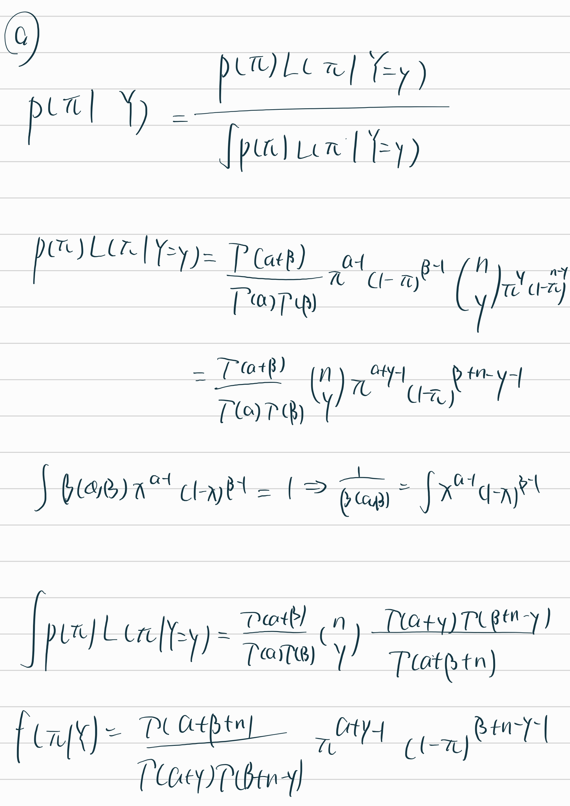
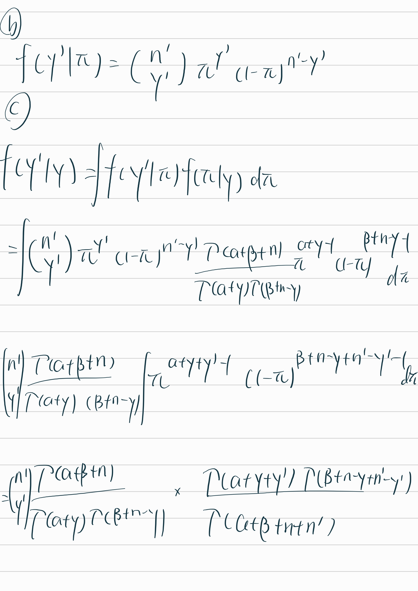
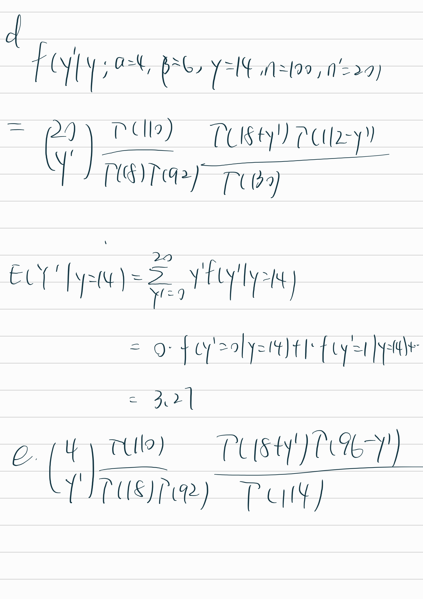

```{r setup, include=FALSE}
library(knitr)
knitr::opts_chunk$set(echo=TRUE, 
                      cache=FALSE, 
                      fig.width=5, 
                      fig.height=5,
                      fig.align='center')
indent1 = '    '
indent2 = paste(rep(indent1, 2), collapse='')
indent3 = paste(rep(indent1, 3), collapse='')
r = function(x, digits=2){ round(x, digits=digits) }
library(tidyverse)
library(reshape2)
```

### Problem 1. Posterior Credible Intervals

One way for us to learn more about posterior distributions is to find some credible intervals. Suppose we have a posterior density of a parameter $\lambda$, defined by $\lambda|y \sim \text{Gamma}(4, 1)$.

**a.** (7pts) Plot this distribution. Construct the posterior middle 95% credible interval for $\lambda$. The middle 95% interval is such that 2.5% of the probability mass is left to the left and 2.5% to the right. Save the lower and upper endpoints in a vector of length 2, called `middle_95`. Using either line segments or shading, display this interval on the plot.

```{r}
set.seed(1)
shape = 4
rate = 1
lambda <- rgamma(10000,shape,rate)

low_q <- qgamma(0.025, shape, rate)
upper_q <- qgamma(0.975, shape, rate)
middle_95 = c(low_q, upper_q)

ggplot(data = data.frame(x = lambda), aes(x = x)) +
    geom_density(col = "black") +
    geom_ribbon(data = data.frame(x = lambda[lambda >= low_q & lambda <= upper_q]), aes(x= x, ymin = 0, ymax = dgamma(x, shape = shape, rate = rate)), 
              fill = "lightgray", alpha = 0.5) +
    geom_vline(xintercept = low_q, color = "red", linetype = "dashed")+
    geom_vline(xintercept = upper_q, color = "red", linetype = "dashed")

```

**b.** (5pts) Interpret the interval you found. How is it different from a frequentist confidence interval?

The credible interval suggest that there's a 95% probability that lambda lies within the interval (1.09, 8.77). It's an interval estimate that, given the data and the prior, contains the parameter with a certain probability. The Frequentist CI doesn't account for effect of the observed value, it produces intervals that contain the true parameter value approximately 95% of the time (for a 95% confidence interval).

**c.** (8pts) Besides the middle 95% credible interval, we could also find the 95% highest posterior density (HPD) region. This region contains the 95% of posterior values with the highest posterior densities. The HPD region will always be the shortest credible interval for a given probability, since it by definition contains the values of $\lambda$ with the highest probability of occurring. Use `HDInterval::hdi()` to construct the HPD region. Save the lower and upper endpoints of this region in a variable called `hdi_region`. Add this interval to the plot you made in part (a), making sure that both intervals are distinguishable on the plot.

```{r}
library(HDInterval)
hdi_region = hdi(lambda, credMass = 0.95)
ggplot(data = data.frame(x = lambda), aes(x = x)) +
    geom_density(col = "black") +
    geom_ribbon(data = data.frame(x = lambda[lambda >= low_q & lambda <= upper_q]), aes(x= x, ymin = 0, ymax = dgamma(x, shape = shape, rate = rate), 
              fill = "quantile"), alpha = 0.3) +
    geom_ribbon(data = data.frame(x = lambda[lambda >= hdi_region[1] & lambda <= hdi_region[2]]), aes(x= x, ymin = 0, ymax = dgamma(x, shape = shape, rate = rate), 
              fill = "hpd"), alpha = 0.3) +
    geom_vline(xintercept = low_q, color = "red", linetype = "dashed")+
    geom_vline(xintercept = upper_q, color = "red", linetype = "dashed")+
    geom_vline(xintercept = hdi_region[1], color = "blue", linetype = "dashed")+
    geom_vline(xintercept = hdi_region[2], color = "blue", linetype = "dashed")+
    scale_colour_manual("",values=c("hpd"="blue", "quantile"="red"))+
    scale_fill_manual("",values=c("hpd"="blue", "quantile"="red"))

```

**d.** (5pts) Based on your plot, how do the two kinds of 95% credible intervals differ? How long is the middle interval? The HDI interval?

A quantile-based CI is calculated by finding the values below which a certain cumulative percentage of the data fall. quantile-based CI assumes that the probability mass is evenly distributed around the median, which is not the case in non-symmetrical distributions like gamma. HPD, defined as the shortest possible intervals containing a given portion of the probability density. HPD-based CI always includes the mode of the distribution and considers the shape of the distribution, making it more suitable for gamma

```{r}
diff(middle_95)
diff(hdi_region)
```

### Problem 2. Posterior predictive Beta-Binomial

As we saw in the lectures, it is sometimes possible to derive an exact posterior predictive model. In this exercise we will discuss one further example. To begin, suppose we observe $Y = y$ successes in $n$ trials where $Y\mid\pi \sim Bin(n,\pi)$ and $\pi \sim Beta(\alpha, \beta)$.

**a.** (5pts) Identify the posterior probability density function (pdf) of $\pi$ given the observed data $Y = y$, denoted by $f(\pi \mid y)$. This will depend on $(y,n,\alpha,\beta,\pi)$.

**b.** (5pts) Suppose we conduct $n'$ *new* trials, wheren $n'$ might differ from our original number of trials $n$) and let $Y' = y'$ be the observed number of successes in these new trials. Identify the conditional probability mass function (pmf) of $Y'$ given $\pi$, denoted by $f(y' \mid \pi)$. This will depend on $(y',n',\pi)$.

**c.** (10pts) Idenfity the posterior predictive pmf of $Y'$, denoted by $f(y' \mid y)$. This will depend on $(y, n, y', n',\alpha,\beta)$.

**d.** (7pts) Suppose now that your posterior model for $\pi$ is based on a prior model with $\alpha = 4$ and $\beta=6$ and an observed $y=14$ successes in $n=100$ original trials. We plan to conduct $n'=20$ *new* trials. Specify the posterior predictive pmf of $Y'$, the number of successes we might observe in these 20 trials.

**e.** (8pts) Continuing part d., suppose instead we plan to conduct $n'=4$ *new* trials. Specify and sketch the posterior predictive pmf of $Y'$, the number of successes we might observe in these 4 trials.

  

```{r}
pmf <- function(y) {
    p = choose(4,y) * gamma(110)/(gamma(18)*gamma(92)) * gamma(18+y)*gamma(96 - y)/gamma(114)
    return(p)
}

y=0:4
prob = pmf(y)

ggplot(data=data.frame(x = y, y = prob), aes(x=x, y=y)) +
    geom_point() +
    geom_line()


paste("Expected Number of Success:", sum(y*prob))
```

### Problem 3. Australian temperature

Let $\mu$ be the average 3 p.m. temperature in Perth, Australia. Not knowing much about Australian weather, your friend's prior understanding is that the average temperature is likely around 30 degrees Celsius, though might be anywhere between 10 and 50 degrees Celsius. To learn about $\mu$, they plan to analyze 1000 days of temperature data. Letting $Y_i$ denote the 3 p.m. temperature on day $i$, they'll assume that daily temperatures vary Normally around $\mu$ with a standard deviation of 5 degrees: $$Y_i \sim N(\mu, 5^2).$$ **a.** (5pts) Tune and plot a Normal prior for $\mu$ that reflects your friend's understanding.

```{r}
mu = rnorm(10000, 30, sqrt(20))
ggplot(data.frame(x=mu), aes(x)) +
    geom_histogram(aes(y = ..density..), binwidth = 0.5, color = "black", fill = "lightblue") +
    geom_density(col="blue")
```

**b.** (7pts) The `weather_perth` data set in the folder `homework4/data/` includes 1000 daily observations of 3 p.m. temperatures in Perth (`temp3pm` column). Plot this data and discuss whether it's reasonable to assume a Normal model for the temperature data.

```{r}
load("data/weather_perth.RData")
ggplot(data = weather_perth, aes(x = temp3pm)) +
    geom_histogram()

library(car)
qqPlot(weather_perth$temp3pm)
shapiro.test(weather_perth$temp3pm)
ks.test(weather_perth$temp3pm, "pnorm")
# The qqplot and Normality test suggest that the distribution of 3pm temperature is not likely to be normally distributed
```

**c.** (8pts) Identify the posterior model of $\mu$ and verify your answer using the function `summarize_normal_normal()` saved in the folder `homework4/functions`.

$$
\mu | y_1,\ldots,y_n \sim N (\theta \frac{\sigma^2}{n\tau^2+\sigma^2} + \bar y \frac{n\tau^2}{n\tau^2 + \sigma^2}, \frac{\tau^2}{n\tau^2 + \sigma^2})
$$

$$
\mu | y_1,\ldots,y_n \sim N (30\cdot \frac{25}{1000\cdot 20+ 25} + \bar y \frac{1000\cdot 20}{1000\cdot 20 + 25}, \frac{20*25}{1000\cdot 20 + 25})
$$ $$
\mu | y_1,\ldots,y_n \sim N (24, 0.025)
$$

```{r}
y_bar = mean(weather_perth$temp3pm)
post_mu = (30*25 + y_bar*1000*20)/(1000*20+25)
post_var = (20*25)/(1000*sqrt(20)^2+25)
source("functions/summarize_normal_normal.R")
summarize_normal_normal(30, sqrt(20), 5, y_bar, 1000)
```

**d.** (10pts) Plot the prior pdf, likelihood function, and posterior pdf of $\mu$. Describe the evolution in your understanding of $\mu$ from the prior to the posterior.

```{r}

sigma = 5

prior_data = rnorm(10000, 30, sqrt(20))

ggplot(data=data.frame(x=prior_data), aes(x=x)) +
    geom_density()

likelihood_data = c()
for (i in prior_data) {
    likelihood_data = c(likelihood_data, sum(log(dnorm(weather_perth$temp3pm, i, 5))))
}

ggplot(data=data.frame(x = prior_data, y = likelihood_data), aes(x=prior_data, y=likelihood_data)) +
    geom_line() +
    geom_vline(xintercept = y_bar, col = "red")


post_data = rnorm(10000, post_mu, sqrt(post_var))

ggplot(data=data.frame(x=post_data), aes(x=x)) +
    geom_density()
```

The prior is normal distribution

The Normal-Normal conjugacy framework assumes that our observations $X_1, X_2, ..., X_n$ are normally distributed around an unknown mean $\mu$ with a known standard deviation $\sigma$. We then choose a prior distribution for $\mu$ that is also normal with sd $\tau$.

then we update our belief about $\mu$ based on the observed data using Bayes' theorem, resulting in a posterior distribution for $\mu$, which is normal because of the conjugacy.

The posterior mean and variance can be derived by

$\mu_n = \frac{\tau^2 \sum_{i=1}^{n} X_i + \sigma^2 \mu_0}{n\tau^2 + \sigma^2}$

$\tau_n^2 = \frac{\tau^2 \sigma^2}{n\tau^2 + \sigma^2}$

The posterior mean is a weighted average of the prior mean and the sample mean, where the weights are inversely proportional to their respective variances. The posterior variance decreases as the number of observations $n$ increases, reflecting increased certainty about the value of $\mu$.

### Problem 4. Normal-Normal calculation

Prof. Abebe and Prof. Morales both recently finished their PhDs and are teaching their first statistics classes at Bayesian University. Their colleagues told them that the average final exam score across all students, $\mu$, varies Normally from year to year with a mean of 80 points and a standard deviation of 4. Further, individual students' scores $Y$ vary Normally around $\mu$ with a known standard deviation of 3 points.

**a.** (5pts) Prof. Abebe conducts the final exam and observes that his 32 students scored an average of 86 points. Calculate the posterior mean and variance of $\mu$ using the data from Prof. Abebe's class.

```{r}
abebe <- summarize_normal_normal(80, 4, 3, 86, 32) %>% filter(model == "posterior")
print(abebe)
```

**b.** (5pts) Prof. Morales conducts the final exam and observes that her 32 students scored an average of 82 points. Calculate the posterior mean and variance of $\mu$ using the data from Prof. Morales' class.

```{r}
morales <- summarize_normal_normal(80, 4, 3, 82, 32) %>% filter(model == "posterior")
print(morales)
```

**c.** (10pts) Next, use Prof. Abebe and Prof. Morales' combined exams to calculate the posterior mean and variance of $\mu$. Interpret your results.

```{r}
combined <- summarize_normal_normal(80, 4, 3, (86+82)/2, 64) %>% filter(model == "posterior")
print(combined)
```

The combined data accounts for a total of 64 students and a y_bar of 84. Thus the posterior mean is between the posterior mean of Abebe's class and Morales's class. The variance is lower than both because of the doubled n.
