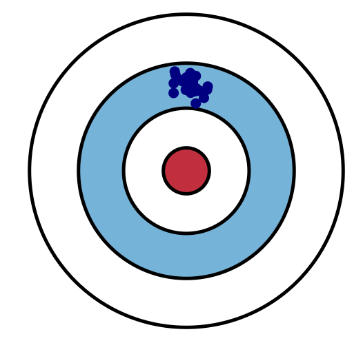
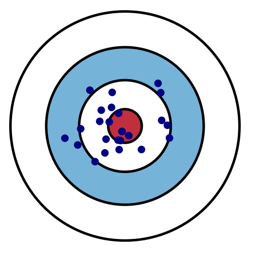

```{r, echo=FALSE, warning=FALSE}
library(knitr)
library(ggplot2)
library(kableExtra)
library(patchwork)
suppressPackageStartupMessages(library(rstan))
suppressPackageStartupMessages(library(tidyverse))
opts_chunk$set(echo=FALSE, fig.align='center', out.width="60%") 
knitr::opts_chunk$set(dpi=300, fig.width=7)
options("kableExtra.html.bsTable" = T)
ig <- function(file) {knitr::include_graphics(file)}
source("../scripts/make_figs.R")
source("../scripts/color_defs.R")
```

### Announcements

- Reading: Section 5.3.3 and 5.3.4

---

### The Normal Distribution

- One of the most utilized probability models in data analysis

- Central Limit Theorem

- Separate parameters for the mean and the variance (intuitive)

---

### Normal Distribution

- Symmetric with  mode = median =  mean = $\mu$

- Approximately 95% of the population lies within two standard deviations of the mean

- Density: $$p ( y | \mu , \sigma ^ { 2 } ) = \frac { 1 } { \sqrt { 2 \pi \sigma ^ { 2 } } } e ^ { - \frac { 1 } { 2 } \left( \frac { y - \mu } { \sigma } \right) ^ { 2 } } , \quad - \infty < y < \infty$$

--

- $X \sim N(\mu_x, \sigma_x^2)$ and $Y \sim N(\mu_y, \sigma_y^2)$ with X and Y independent then $$aX + bY \sim N(a\mu_x + b\mu_y, a^2\sigma_x^2 + b^2\sigma_y^2)$$

- In R: `dnorm, rnorm, pnorm, qnorm`.
    + Warning: the argument to the `norm` functions `R` is $\sigma$ not $\sigma^2$!

---

### The Central Limit Theorem


```{r, fig.width=6, fig.height=3, out.width="85%"}
figure_5_7(cols_diverging(3))
```

<br>

&emsp; &emsp; CLT: $\bar y \approx N(E[Y], \text{Var}[Y]/n)$

---

### Bayesian inference in the normal model

- Assume $y_1, ... y_n \sim N(\mu, \sigma^2)$ with $\sigma^2$ a known constant

- Lets start with a non-informative, improper prior: $p(\mu) \propto \text{const}$

- What is the posterior distribution $p(\mu \mid y_1, ... y_n, \sigma^2)$?

---

### Bayesian inference in the normal model


---

### Bayesian inference in the normal model


---

### Bayesian inference in the normal model

- Assume $y_1, ... y_n \sim N(\mu, \sigma^2)$ with $\sigma^2$ a known constant

- The normal prior distribution is conjugate for $\mu$ in the normal sampling model

- Sampling distribution, prior distribution and posterior distribution are all normal.  

- Assume the prior is $p(\mu) \sim N(\mu_0, \tau^2)$

- What are the parameters of the posterior $p(\mu \mid y_1, ... y_n, \sigma^2)$?

---

### Bayesian inference in the normal model


---

### Bayesian inference in the normal model


---

### A conjugate prior for the normal likelihood

- The normal distribution is conjugate for the normal likelihood 
    + Often called the "normal-normal model"

- $Y_i \sim N(\mu, \sigma^2)$ and $\mu \sim N(\mu_0, \tau^2)$ implies that the posterior distribution $p(\mu \mid y)$ is also normally distributed: 

$$\mu \mid Y \sim N(\mu_n, \tau^2_n)$$ 

&emsp; where $\mu_{ n } = \frac{\frac { 1 } { \tau ^ { 2 } } \mu_{0} + \frac { n }{ \sigma ^ { 2 } } \overline { y } } { \frac { 1 }{ \tau ^ { 2 } } + \frac{ n } { \sigma^{ 2 } }}$ and $\tau_{ n }^{2} = \frac{1}{\frac{ 1 }{ \tau^{ 2 } } + \frac{ n }{ \sigma^{ 2 }}}$

---

### The posterior mean and pseudo-counts

$$\begin{aligned}
\mu_n &= \frac{\frac{1}{ \tau^2}}{\frac{1}{\tau^2} + \frac{n}{\sigma^2}}\mu_{ 0 } + \frac{\frac{n}{\sigma^2}}{\frac{1}{\tau^2} + \frac{n}{\sigma^2}} \overline { y }  \\
&= (1-w) \mu_0 + w \bar y
\end{aligned}$$


&emsp; where $w = \frac{\frac{n}{\sigma^2}}{\frac{ 1 }{ \tau^{ 2 }} + \frac{ n }{ \sigma^{ 2 }}}$

<br>

Can we think about the normal prior parameters in terms of pseudo-counts?

---

### The posterior mean and pseudo-counts

$$\begin{aligned}
\mu_n &= \frac{\frac{1}{ \tau^2}}{\frac{1}{\tau^2} + \frac{n}{\sigma^2}}\mu_{ 0 } + \frac{\frac{n}{\sigma^2}}{\frac{1}{\tau^2} + \frac{n}{\sigma^2}} \overline { y }  \\
&= (1-w) \mu_0 + w \bar y
\end{aligned}$$


&emsp; where $w = \frac{\frac{n}{\sigma^2}}{\frac{ 1 }{ \tau^{ 2 } } + \frac{ n }{ \sigma^{ 2 }}}$

<br>

- Let's reparameterize: $\tau^2 = \frac{\sigma^2}{\kappa_0}$

- Then: the posterior variance is $\frac{\sigma^2}{\kappa_0 + n}$

- And: $(1-w) = \frac{\kappa_0}{\kappa_0 + n}$

- $\kappa_0$ are the prior counts and $\mu_0$ is the prior sample average.

<!-- $$ -->
<!-- \begin{aligned} -->
<!-- \tau_{ n }^{2} &= \frac{1}{\frac{ 1 }{ \tau^{ 2 } } + \frac{ n }{ \sigma^{ 2 }}}\\ -->
<!-- \end{aligned} -->
<!-- $$ -->

---

### Conjugate prior with increasing variance

<br>

```{r, fight.width=7, fig.height=4, out.width="75%"}
ggplot(tibble(x=rnorm(100)), aes(x)) + 
  stat_function(fun = dnorm, geom = "line", aes(col="1"), size=2) +
  stat_function(fun = function(x) dnorm(x, 0, 2), geom = "line", aes(col="2"), size=2) +
  stat_function(fun = function(x) dnorm(x, 0, 3), geom = "line", aes(col="3"), size=2) +
  stat_function(fun = function(x) dnorm(x, 0, 4), geom = "line", aes(col="4"), size=2) + 
  stat_function(fun = function(x) dnorm(x, 0, 50), geom = "line", aes(col="50"), size=2) + 
  xlim(c(-5,5)) + ylab("") + xlab("") + theme_bw(base_size=16) + scale_colour_manual("Prior Variance", values=cols_diverging(5)) + ggtitle("Mean-zero prior distributions")
```

---

class: middle, center, inverse;
background-image: none;

# Bayes Estimators

---

### Estimators: Bayes / Frequentist Unification

- Bayesian inference provides a straightforward procedure for producing estimators given your prior beliefs.

  1. Compute posterior distribution

  2. Summarize the posterior distribution with a point estimator (e.g. posterior mean or posterior mode) and a probability interval

--

- Frequentists provide tools for evaluating the sampling properties of an estimator.
    + Bias, variance and MSE of an estimator
    + Well-calibrated probability intervals

- Both are useful!

---

### The Bias-Variance Tradeoff

Reminder: an estimator is a random variable, an estimate is a constant

- _Bias_: systematic sampling error of the estimator

- _Variance_: variance of the estimator (from sampling & measurement error)

--

- Often we evaluate an estimator in terms of mean square error: $\text{MSE}(\hat \theta) = E_Y (\hat \theta - \theta)^2$

- The Bias-Variance tradeoff: $\text{MSE}(\hat \theta) = \text{Var}(\hat \theta) + \text{Bias}(\hat \theta)^2$

---

### The Bias-Variance Tradeoff

- Variance of an estimator comes sampling from a population

    + If you were to repeatedly draw new samples of the same size how much would your estimates vary?
    
    + e.g. if $y_i \sim N(\mu, \sigma^2)$ then $\text{Var}(\bar Y) = \sigma^2 / n$

---

### Bias

.center[The expected difference between the estimate and the response]

&nbsp;

```{r, echo=FALSE, out.width='300px', fig.align='center', include=TRUE}

```

.center[Statistical definition of bias:] $$E_Y[\hat \theta - \theta]$$

---

### Variance

.center[How variable is the prediction about its mean?]

&nbsp;

```{r, echo=FALSE, out.width='300px', fig.align='center'}

```

.center[Statistical definition of variance:] $$E_Y[\hat \theta - E_Y[\hat \theta]]^2$$

---

### Bias and Variance

```{r, echo=FALSE, out.width='40%', fig.align='center'}
ig("images/bias_variance.png")
```

$$\underbrace{\text{MSE}(\hat \theta)}_{\text{accuracy}} = \underbrace{\text{Var}(\hat \theta)}_{\text{variance}} + \underbrace{\left(\, E[\hat \theta - \theta]\right)^2}_{\text{bias squared}}$$

---

### The Bias-Variance Tradeoff 

- The prior distribution (usually) makes your estimator biased...

- But the prior distribution also (usually) reduces the variance!

- Example: compute the frequentist mean and variance of the posterior mean.

---

### Example: IQ scores

- Scoring on [IQ tests](https://en.wikipedia.org/wiki/Intelligence_quotient) is designed to yield a N(100, 15) distribution for the general population

- We observe IQ scores for a sample of $n$ individuals from a particular town and estimate $\mu$, the town-specific IQ score

- If we lacked knowledge about the town, a natural choice would be $\mu_0 = 100$ 

- Suppose the true parameters for this town are $\mu = 112$  and $\sigma=13$ 

  + The town is smarter on average than the general population

---
    
### Example: IQ scores

- What is the mean squared error of the MLE? MSE of the posterior mean?

- $\operatorname { MSE } \left[ \hat \mu_{MLE} \right] = \operatorname { Var } \left[ \hat \mu_{MLE} \right] = \frac { \sigma ^ { 2 } } { n } = \frac { 169 } { n }$

- $\operatorname { MSE } \left[ \hat { \mu } _ { PM } | \theta _ { 0 } \right] = w ^ { 2 } \frac { 169 } { n } + ( 1 - w ) ^ { 2 } 144$

--

- Reminder: $w = \frac{n}{\kappa_0 + n}$.  For what values of $n$ and $\kappa_0$ is the MSE smaller for the posterior mean estimator than the maximum likelihood?

---

### Example: IQ scores

<br>

```{r, fig.width=6, fig.height=3, out.width="85%", warning=FALSE}
figure_5_6(cols_diverging(3))
```

---

class: middle, center, inverse;
background-image: none;

# Decision Theory

---

### Why the posterior mean?

- Often times we need to make a "decision" by providing a single estimate

- The posterior provides a full distribution over $\theta$, which can be summarized in infinitely many ways

- Specify a _loss function_ which describes the cost of estimating $\hat \theta$ when the truth is $\theta$

---

### Bayes Estimators

- The _loss function_: $L(\hat \theta, \theta)$

    + Squared error: $L(\hat \theta, \theta) = (\hat \theta - \theta)^2$
    + Absolute error: $L(\hat \theta, \theta) = |\hat \theta - \theta|$

- The **Bayes risk** is the posterior expected loss:  

$$E_{\theta \mid y}[L(\hat \theta, \theta)] = \int L(\hat \theta, \theta) p(\theta \mid y) d\theta $$

- Choose an estimator of $\theta$ based on minimizing the Bayes risk.

- An estimator $\hat \theta$ is said to be a **Bayes estimator** if it minimizes the Bayes risk among all estimators. 

---

### Squared error loss

$$\begin{aligned}
\underset{\hat \theta}{\text{min }} E_{\theta\mid y}(\hat \theta - \theta)^2 &= \underset{\hat \theta}{\text{min }} \int (\hat \theta - \theta)^2 p(\theta \mid y) d\theta\\
\end{aligned}$$

Differentiate with respect to $\hat \theta$ and set equal to zero:

---

### Absolute loss

$$\begin{aligned}
\underset{\hat \theta}{\text{min }} E_{\theta\mid y}|\hat \theta - \theta| &= \underset{\hat \theta}{\text{min }} \int |\hat \theta - \theta| p(\theta \mid y) d\theta\\
\end{aligned}$$

Differentiate with respect to $\hat \theta$ and set equal to zero:

---

### Loss functions in practice

- Squared error and absolute error are good default loss functions

  + Motivated largely by mathematical considerations

- In practice we should define a loss function specific to our problem

- Loss in dollars? Loss in "quality of life"? 

---

<!-- ### Decision making: flu example -->

<!-- - The CDC produces estimates of the expected prevalance and severity of flu during flu season -->

<!-- - Assume $\theta$ represents severity of the flu -->

<!-- - $p(\theta \mid y)$ is CDC posterior distribution based on initial data about the upcoming flu season -->

<!-- - $\hat \theta$ determines how much flu vaccine to make. How do we determine $L(\hat \theta, \theta)$? -->


<!-- --- -->

class: middle, center, inverse;
background-image: none;

## Normal distribution, unknown  variance


---

## Known mean, unknown variance

- Assume we have $n$ observations with mean $\mu$ (known) and variance $\sigma^2$ (unknown)

- Define $d_i = (y_i - \mu)$ for notation convenience

- What is the likelihood $p(\sigma^2 \mid \mu, d_1, \ldots d_n)$?

---

## Known mean, unknown variance

- If $X \sim Gamma(a,b)$, then $Y=\frac{1}{X} \sim Inverse-Gamma(a,b)$

- $p(y \mid a, b) = \frac{b^a}{\Gamma(a)} y^{-a-1} \exp\left\{-\frac{b}{y} \right\}$

- The inverse-gamma distribution is the conjugate prior distribution for the
variance
---

### Joint inference for normal parameters
  
- In practice, both $\mu$ and $\sigma$ are unknown in the normal model.

- We've considered models when either $\mu$ is unknown but $\sigma$ is known.  

- In practice neither is known!

- Need to specify a joint prior distribution: $p(\mu, \sigma)$

- This is our first look at _multi-parameter_ models.  

---

### Joint inference for the mean and variance

In the normal model we typically factorize the prior distribution $p(\mu, \sigma) = p(\mu \mid \sigma)p(\sigma)$.  
<br>
Specifically:

$$\begin{aligned} \sigma^2 & \propto \frac{1}{\sigma^2} \\ { \mu | \sigma  } & \sim \text { normal } \left( \mu_{0} , \sigma^{ 2 } / \kappa_{0} \right) \\  Y _ { 1 } , \ldots , Y _ { n } | \mu , \sigma & \sim \text { i.i.d. normal} \left( \mu , \sigma ^ { 2 } \right) \end{aligned}$$

- $\mu_0$ is interpreted as the prior sample mean 

- $\kappa_0$ is a prior sample size

---

### Example: midge wing length

- Modeling wing length of different specifies of midge (small, two-winged flies)

- From prior studies: mean wing length close to 1.9mm.

- Prior mean for $\mu$ is $\mu_0 = 1.9$ and non-informative prior for $\sigma$.

- Prior sample sizes: choose $\kappa_0 = 1$

- $(\bar y, s^2) = (1.804, 0.0169)$ are the sufficient statistics

```{r normal_setup, echo=FALSE, warning=FALSE, cache=TRUE}

### prior mean for mu and prior counts for mu
mu0 <- 1.9
k0 <- 1

### sufficient statistics are sample mean and sample variance
y <- c(1.64, 1.7, 1.72, 1.74, 1.82, 1.82, 1.82, 1.9, 2.08)
n <- length(y)
ybar <- mean(y)

## sample variance and standard deviation
s2 <- var(y)
s <- sqrt(s2) 

```

---

### Working with the log posterior

- As always, we will write down $p(\theta \mid y) \propto p(y\mid \theta)p(\theta)$

- In code, we always work with the **log-posterior** for numerical reasons

    + Mathematically it makes no difference, but computationally it is important

    + $L(\theta) \propto \prod p(y_i \mid \theta)$ is very small for moderate sample size (underflow)

    + $\ell(\theta) = \sum log(p(y_i \mid \theta))$ is numerically stable
    
- Monte Carlo methods only require that we can evaluate the log posterior

---


### Grid approximation to the posterior distribution

```{r normal_post, dependson="normal_setup", echo=TRUE, eval=TRUE}

log_normal_posterior <- Vectorize(function(mu, sigma) {
  
  ### log likelihood 
  sum(dnorm(y, mu, sigma, log=TRUE)) + 
  ## plus log prior
  dnorm(mu, mu0, sigma/sqrt(k0), log=TRUE) +
  -2*log(sigma)

})


post_grid <- as_tibble(
  expand.grid(seq(1.6, 2.0, by=0.001), 
              seq(0.01, 0.25, by=0.001)))
colnames(post_grid) <- c("mu", "s")
```


---

### Grid approximation to the posterior distribution

```{r, dependson="normal_post", eval=FALSE, echo=TRUE}

post_grid %>% 
  mutate(log_density = log_normal_posterior(mu, s)) %>% 
  mutate(density = exp(log_density - max(log_density)) %>% 
  ggplot() + 
  geom_raster(aes(mu, s, fill=exp(log_density))) + #<<
  xlim(c(1.7, 1.95)) + ylim(c(0.05, 0.2)) +
  xlab(expression(mu)) + 
  ylab(expression(sigma)) + 
  theme_bw() + 
  scale_fill_continuous(type="viridis")

```

---


### Grid approximation

```{r plot1, dependson="normal_post", echo=FALSE, eval=TRUE, warning=FALSE, out.width="75%", fig.width=6, fig.height=5}

post_grid %>% 
  mutate(log_density = log_normal_posterior(mu, s)) %>% 
  mutate(density = exp(log_density - max(log_density))) %>% 
  ggplot() + 
  geom_raster(aes(mu, s, fill=density)) + 
  xlim(c(1.7, 1.95)) + ylim(c(0.05, 0.2)) +
  xlab(expression(mu)) + 
  ylab(expression(sigma)) + 
  theme_bw(base_size=16
           ) + 
  scale_fill_continuous(type="viridis")

```

---

### Contour Plot

```{r, dependson="plot1", echo=TRUE, eval=FALSE, warning=FALSE, out.width="60%", tidy=FALSE}

post_grid %>% 
  mutate(density = exp(log_density - max(log_density))) %>% 
  ggplot() + 
  geom_contour(aes(mu, s, z=density, colour=stat(level)), size=2) + #<< 
  xlim(c(1.7, 1.95)) + ylim(c(0.05, 0.2)) +
  xlab(expression(mu)) + ylab(expression(sigma)) + 
  ggtitle("Posterior Contours") +
  theme_bw(base_size=16) + 
  scale_color_continuous(type="viridis")

```

---

### Contour Plot (Standard Deviation)

```{r, dependson="plot1", echo=FALSE, eval=TRUE, warning=FALSE, out.width="60%"}

post_grid %>% 
  mutate(density = exp(log_normal_posterior(mu, s))) %>% 
  ggplot() + 
  geom_contour(aes(mu, s, z=density, colour=stat(level))) + 
  xlim(c(1.7, 1.95)) + ylim(c(0.05, 0.2)) +
  xlab(expression(mu)) + ylab(expression(sigma)) + 
  ggtitle("Posterior Contours") +
  theme_bw(base_size=16) + 
  scale_color_continuous(type="viridis") + 
  geom_hline(yintercept=s, linetype="dashed") +
  geom_vline(xintercept=ybar, linetype="dashed") 

```

---

### Contour Plot (Precision)

```{r, dependson="plot1", echo=FALSE, eval=TRUE, warning=FALSE, out.width="60%"}

post_grid$prec <- 1/post_grid$s^2

post_grid %>% 
  mutate(density = exp(3/2*log(1/prec) + log_normal_posterior(mu, sqrt(1/prec)))) %>% 
  ggplot() + 
  geom_contour(aes(mu, prec, z=density, colour=stat(level))) + 
  xlim(c(1.7, 1.95)) + ylim(c(0, 150)) +
  xlab(expression(mu)) + ylab(expression(1/sigma^2)) + 
  ggtitle("Posterior Contours") +
  theme_bw(base_size=16) + 
  scale_color_continuous(type="viridis")  + 
  geom_hline(yintercept=1/s2, linetype="dashed") +
  geom_vline(xintercept=ybar, linetype="dashed") 

```

---

### Sampling from the joint posterior

- Contour and raster plots allow us to visualize the posterior (in two dimensions)
  + Need to know approximately where the high posterior density is (not easy)
  
- When we have more than 2 parameters visualization isn't feasible

- How do we summarize the posterior? 
  - e.g. posterior means, posterior probabilities, intervals, etc..

---

### Sampling from the joint posterior

- One approach: convert multi-parameter distribution into the product of many one parameter distributions.


---

### Markov Chain Monte Carlo

- Markov Chain Monte Carlo (MCMC)

- More effective approach to sampling from multi-parameter distributions

- Samples in MCMC are **not** independent samples

---

### MCMC Sampling with Stan


.center[Stan]

<br>

```{r, out.width="20%"}

ig("images/stan_logo.png")
```

<br>

"A state-of-the-art platform for statistical modeling and high-performance statistical computation."

.center[[http://mc-stan.org/](http://mc-stan.org/)]

---

### Monte Carlo Sampling with Stan

- Stan is a "probabilistic programming language" with its own simple syntax

- R interface to Stan via `rstan` package

- Define parameters $\theta$ and datatypes $y$

- Provide sampling model $p(y\mid \theta)$ and prior $p(\theta)$

- Stan translates model syntax into the log posterior density $\text{log}(p(\theta \mid y))$ and automatically generates samples from this density

---

### Example Stan File
```{r, eval=FALSE, echo=TRUE, tidy=FALSE}

// The input data is a vector 'y' of length 'N'.
data { #<<
  int<lower=0> N;
  real<lower=0> k0;
  vector[N] y;
}

// The parameters accepted by the model. Our model
// accepts two parameters 'mu' and 'sigma'.
parameters { #<<
  real mu;
  real<lower=0> sigma;
}

// The model to be estimated. We model the output
// 'y' to be normally distributed with mean 'mu'
// and standard deviation 'sigma'.
model { #<<
  target += -2*log(sigma); //sigma prior
  mu ~ normal(1.9, sigma/k0); // mu prior
  y ~ normal(mu, sigma);
}


```

---

### The Stan File

- A stan file ends in `.stan`

- Three important program blocks in a stan file:
  - Data block
  - Parameter block
  - Model block
  - Each blcok encapsulated in brackets, \{ ... \}.

- Stan needs data types:
  + `int`: integer valued data
  + `real`: continuous data or parameters

- Need to end every line with a semi-colon!

- Need to compile the Stan program before running.

---

### Defining the input data in Stan

```{r, eval=FALSE, echo=TRUE, tidy=FALSE}

// The input data is a vector 'y' of length 'N'.
data {
  int<lower=0> N;
  real<lower=0> k0;
  vector[N] y;
}

```

---

### Defining the model parameters in Stan

```{r, eval=FALSE, echo=TRUE, tidy=FALSE}

// The parameters accepted by the model. Our model
// accepts two parameters 'mu' and 'sigma'.
parameters {
  real mu;
  real<lower=0> sigma;
}

```

---

### Defining the model in Stan

```{r, eval=FALSE, echo=TRUE, tidy=FALSE}


// The model to be estimated. We model the output
// 'y' to be normally distributed with mean 'mu'
// and standard deviation 'sigma'.
model {
  target += -2*log(sigma); //sigma prior
  mu ~ normal(1.9, sigma/k0); // mu prior
  y ~ normal(mu, sigma); // data model
}


```

```{r normal_stan, echo=FALSE, tidy=FALSE, cache=TRUE, message=FALSE}

## Load the rstan library
library(rstan)

# compile stan model.  This may take a minute. #<<
stan_model <- stan_model(file="normal_model.stan") #<<

## data is a list, arguments must match the
## arguments in data block of the stan file
stan_fit <- rstan::sampling(stan_model,
                            data=list(N=n, y=y, k0=0.1),
                            refresh=0)

```

```{r, dependson="normal_setup", echo=TRUE, tidy=FALSE, eval=FALSE, message=FALSE}
## Load the rstan library
library(rstan)

# compile stan model.  This may take a minute.
stan_model <- rstan::stan_model(file="normal_model.stan")

## data is a list, arguments must match the
## arguments in datablock in the stan file
stan_fit <- rstan::sampling(stan_model, #<<
                            data=list(N=n, y=y, k0=k0), #<<
                            refresh=0) #<<

```


---

### Stan: The Basics

```{r run_stan, dependson="normal_setup", echo=TRUE, tidy=FALSE, eval=TRUE, message=FALSE}
library(rstan)

# compile stan model.  This may take a minute.
stan_model <- rstan::stan_model(file="normal_model.stan")

## data is a list, arguments must match the datablock in the stan file
stan_fit <- rstan::sampling(stan_model, #<<
                            data=list(N=n, y=y, k0=k0),#<<
                            refresh=0) #<<

```

---

### Stan: The Basics

```{r stan_results, dependson = "normal_stan", echo=TRUE, tidy=FALSE, message=FALSE}

## Convert Stan output to a list of MC samples
samples <- rstan::extract(stan_fit) #<<

## names in list are the defined parameters
names(samples)

mu_samples <- samples$mu
sigma_samples <- samples$sigma

## By default there will be 4000 samples
length(mu_samples)
```

---

### Stan: The Basics

```{r, dependson="stan_results", echo=TRUE, tidy=FALSE}
## Information about MC samples
summary(mu_samples)
summary(sigma_samples)
summary(1/sigma_samples^2)
```

---

### Visualizing Posterior Samples from Stan

```{r, dependson="stan_results", echo=TRUE, out.width="50%"}
tibble(Mean = mu_samples, Precision=1/sigma_samples^2) %>%
  ggplot() +
  geom_point(aes(x=Mean, y=Precision)) +
  theme_bw(base_size=16)
```